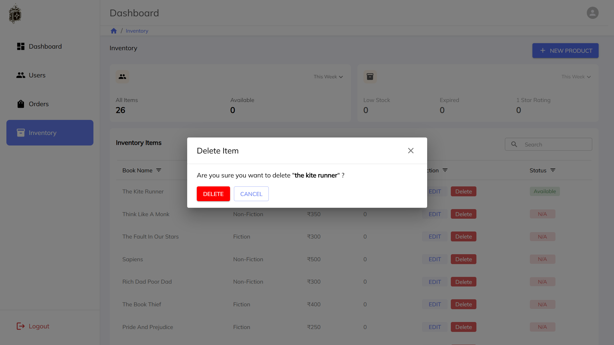

# Admin Dashboard

A modern Admin Dashboard built with React, focused on secure authentication, role-based access control, and scalable server-state management.

This project demonstrates real-world frontend patterns such as protected routes, server-side pagination, URL-synced filters, and React Query–based data handling.

---

## 🚀 Live Demo

🔗 https://admin-dashboard-by-akshit.netlify.app/

---

## 🛠️ Tech Stack

### Frontend

- React.js
- React Router
- TanStack Query (React Query)
- Material UI (MUI)
- Context API

### Backend (Consumed APIs)

- Node.js
- Express.js
- MongoDB

### Deployment

- Netlify (Frontend)

---

## ✨ Features

- 🔐 Authentication using HttpOnly cookies
- 👥 Role-based access control (Admin / Seller / Operator)
- 🧭 Protected routes with redirect handling
- 📊 Reusable DataTable component with:
  - Server-side pagination
  - Sorting
  - Filtering
- 🔍 Debounced search
- 🔗 URL-synced state (page, filters, sorting)
- ⚡ React Query caching & automatic invalidation
- 📱 Responsive layout with sidebar navigation

---

## 🧠 Architecture Highlights

- React Query replaces manual `useEffect` data fetching
- Query invalidation implemented after mutations
- Auth state centralized in `AuthContext`
- UI state (page, search, sort) synced via URL parameters
- No sensitive data stored in `localStorage`

---

## 📂 Project Structure

```bash
src/
├─ assets/
│  └─ Logo.png
├─ components/
│  ├─ common/
│  ├─ filters/
│  ├─ layout/
│  ├─ modals/
│  └─ ui/
├─ config/
│  └─ genres.js
├─ context/
│  ├─ AuthContext.js
│  └─ DashboardStatsContext.js
├─ hooks/
│  ├─ useDebounce.js
│  ├─ useInventory.js
│  ├─ useMutation.js
│  ├─ useOrders.js
│  ├─ useQueryParams.js
│  ├─ useUploadImage.js
│  └─ useUsers.js
├─ pages/
│  ├─ AddInventory.jsx
│  ├─ Dashboard.jsx
│  ├─ Inventory.jsx
│  ├─ Login.jsx
│  ├─ Orders.jsx
│  ├─ Signup.jsx
│  └─ Users.jsx
├─ routes/
│  ├─ AppRoutes.jsx
│  └─ ProtectedRoute.jsx
├─ services/
│  ├─ api.js
│  ├─ authApi.js
│  ├─ booksApi.js
│  ├─ cloudinaryApi.js
│  ├─ dashboardApi.js
│  ├─ ordersApi.js
│  └─ usersApi.js
├─ theme/
│  └─ theme.js
├─ App.jsx
└─ main.jsx

```

## Architecture Overview

- `components/` → Reusable UI components
- `pages/` → Route-level screens
- `hooks/` → Custom business logic hooks
- `services/` → API layer abstraction
- `context/` → Global state management
- `theme/` → MUI theme configuration

---

## 📸 Screenshots





---

## 🧪 Local Setup

- git clone https://github.com/sisodia-akshit/admin-dashboard
- cd admin-dashboard
- npm install
- npm start

---

📌 Notes

Backend APIs are shared with the Bookstore application

Authentication is cookie-based (no tokens stored in frontend)

Designed to simulate real-world admin workflows

---

👤 Author

Akshit Sisodiya
GitHub: https://github.com/sisodia-akshit

---

⭐ Feedback

Suggestions and feedback are welcome.
