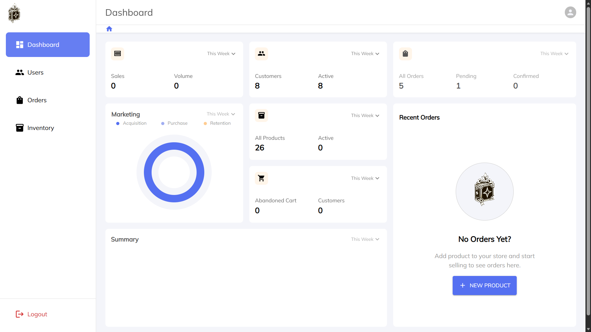
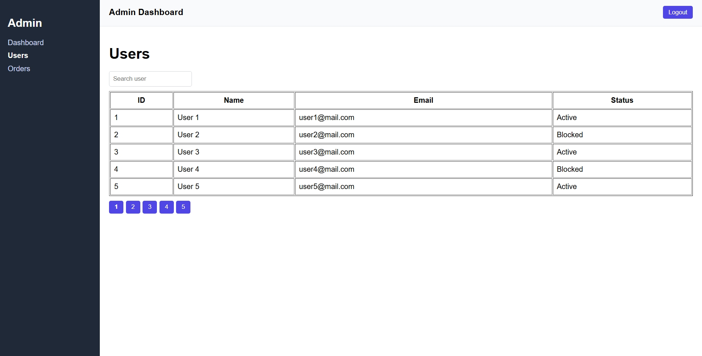
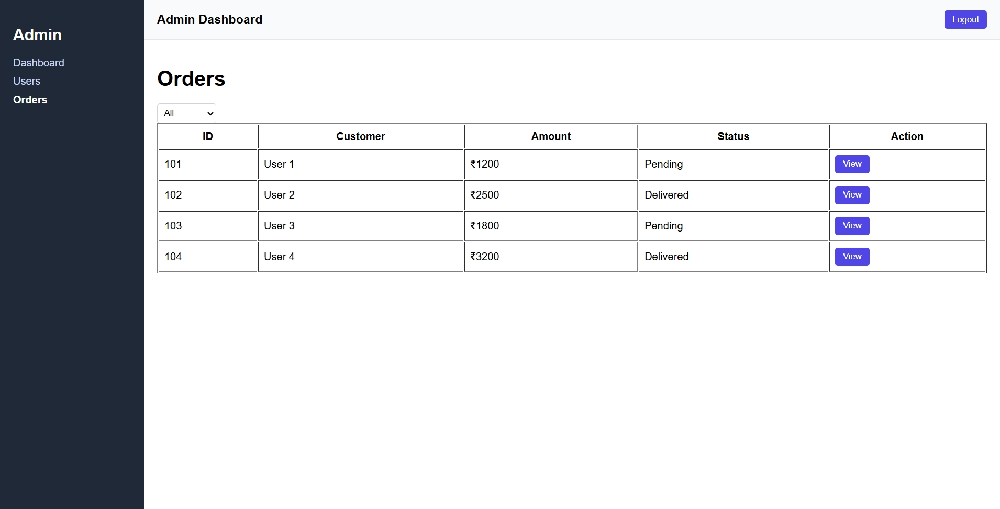
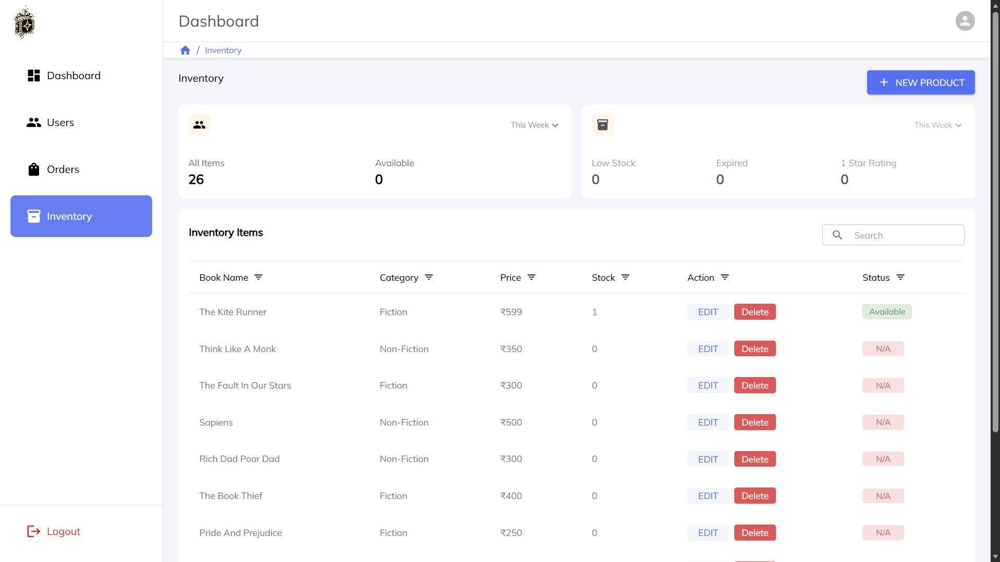
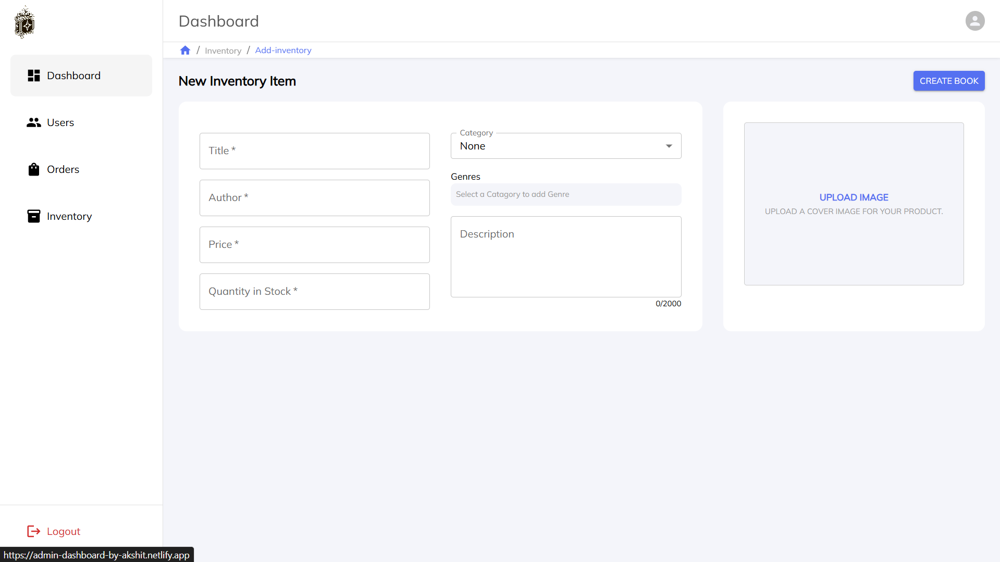
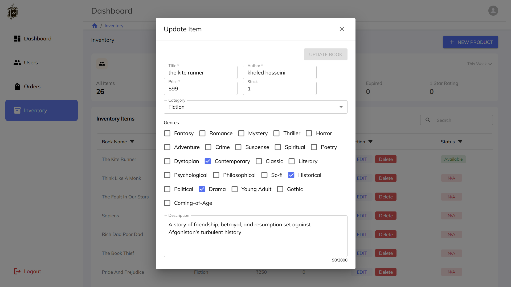
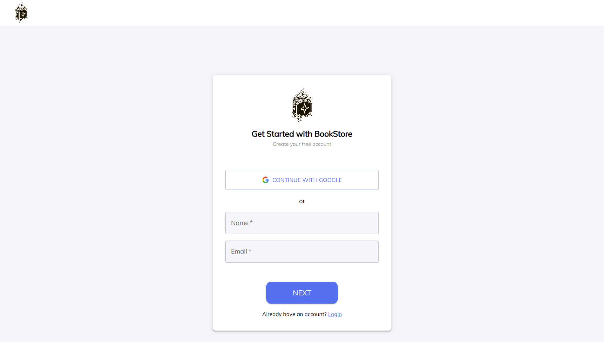

# Admin Dashboard

A modern Admin Dashboard built with React, focused on secure authentication, role-based access, and scalable server-state management.

This project demonstrates real-world frontend patterns such as protected routes, server-side pagination, URL-synced filters, and React Query–based data handling.

---

## 🚀 Live Demo

🔗 https://admin-dashboard-by-akshit.netlify.app/

---

## 🛠️ Tech Stack

### Frontend

React.js

React Router

React Query (TanStack Query)

Context API

### Backend (Consumed APIs)

Node.js

Express.js

MongoDB

### Deployment

Netlify (Frontend)

---

## ✨ Feature

- 🔐 Authentication using HttpOnly cookies

- 👥 Role-based access control (Admin / Seller / Operator)

- 🧭 Protected routes with redirect handling

- 📊 Reusable DataTable component with:

--- server-side pagination

--- sorting

--- filtering

- 🔍 Debounced search

- 🔗 URL-synced state (page, filters, sorting)

- ⚡ React Query caching & invalidation

- 📱 Responsive layout with sidebar navigation

---

## 🧩 Architecture Highlights

- React Query replaces manual useEffect data fetching

- Query invalidation used after mutations

- Auth state centralized in AuthContext

- UI state (page, search, sort) synced via URL parameters

- No sensitive data stored in localStorage

---

## 📸 Screenshots

---

## 📂 Project Structure

src/
 ├─ components/
 │ ├─ DataTable 
 │ ├─ Pagination 
 │ ├─ Filter 
 │ └─ Layout 
 ├─ context/ 
 │ └─ AuthContext 
 ├─ hooks/ 
 │ ├─ useDebounce 
 │ └─ useQueryParams 
 ├─ pages/ 
 │ ├─ Dashboard 
 │ ├─ Users 
 │ └─ Orders 
 └─ services/

---

## 🧪 Local Setup

- git clone https://github.com/sisodia-akshit/admin-dashboard

- cd admin-dashboard

- npm install

- npm start

---

## 📌 Notes

- Backend APIs are shared with the Bookstore application

- Authentication is cookie-based (no tokens in frontend storage)

- Built to simulate real admin workflows

---

## 👤 Author

Akshit Sisodiya
GitHub: https://github.com/sisodia-akshit

---

## ⭐ Feedback

Suggestions and feedback are always welcome!
