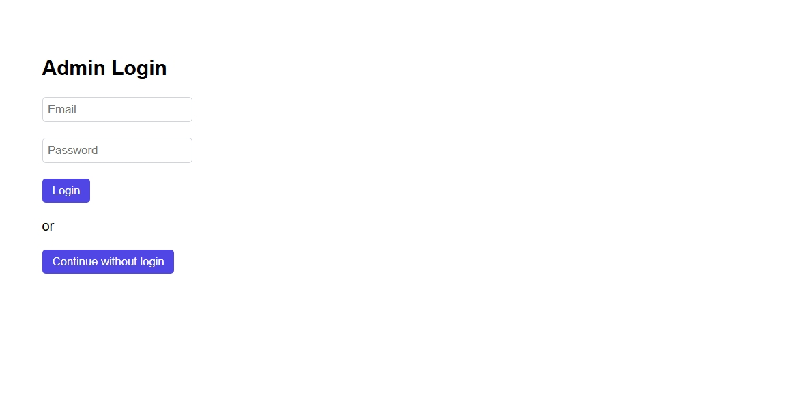
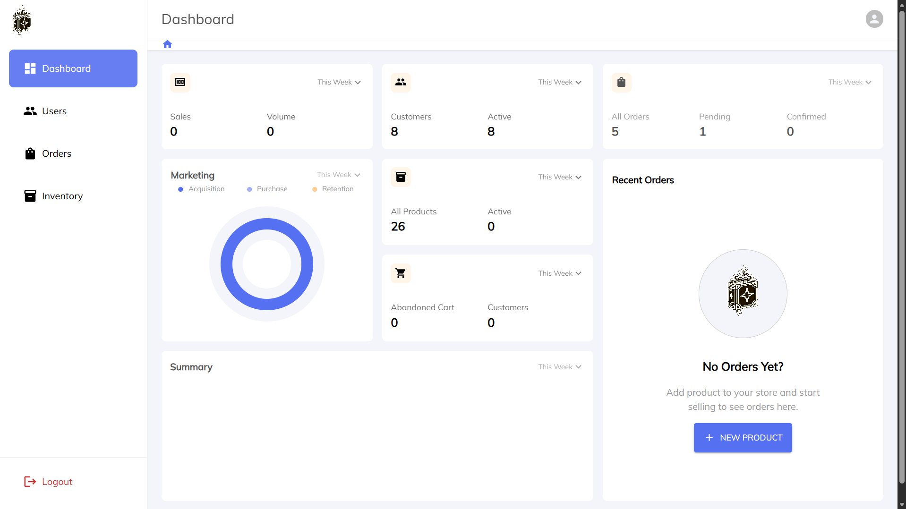
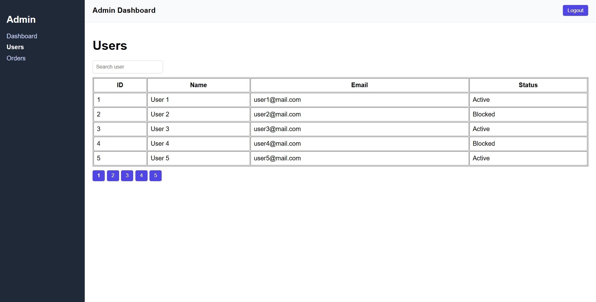
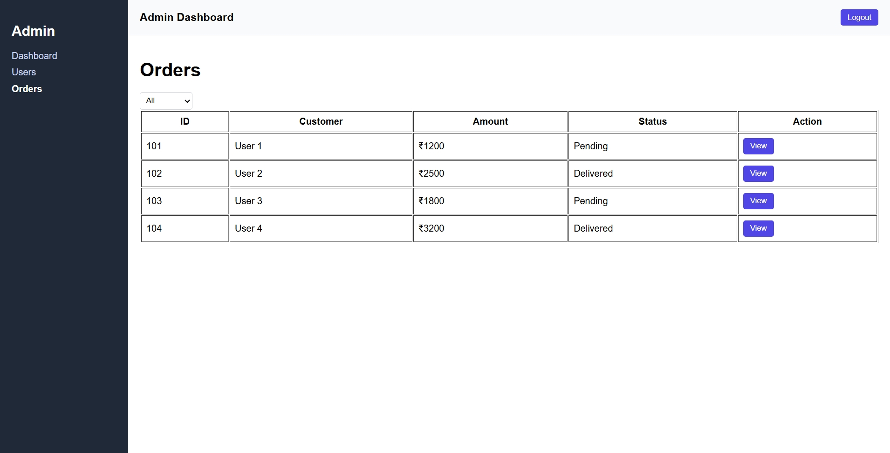

# Admin Dashboard

A responsive **Admin Dashboard** built using **React** to simulate a real-world admin panel experience.  
This project focuses on frontend architecture, state management, protected routes, and responsive UI design.

---

## 🚀 Features

- React Query for server state management
- Server-side pagination, sorting, and filtering
- URL-synced state (search, pagination)
- Authentication with protected routes
- Dynamic dashboard with real stats
- Responsive sidebar with hamburger menu for mobile devices
- Data visualization using charts
- Users management with search and pagination
- Orders management with status filter
- Order details displayed in modal
- Mobile-friendly and clean UI

---

## 🛠️ Tech Stack

- React
- React Router DOM
- Context API
- Recharts
- HTML & CSS
- JavaScript (ES6)

---

## 📸 Screenshots

---

## 🌐 Live Demo

👉 https://admin-dashboard-by-akshit.netlify.app/

---

## 📂 Project Structure

src/
├─ components/
├─ pages/
├─ context/
├─ data/
├─ styles/
└─ App.jsx

---

## 📌 Notes

- This project uses **static (mock) data** for demonstration purposes.
- Authentication is simulated using localStorage.
- Designed to demonstrate frontend concepts used in real admin dashboards.

---

## 👤 Author

**Akshit Sisodiya**  
MERN Stack Developer (Fresher)

- GitHub: https://github.com/sisodia-akshit
- LinkedIn: https://www.linkedin.com/in/akshit-sisodiya-6732602aa/

---

## ⭐ Feedback

Suggestions and feedback are always welcome!
